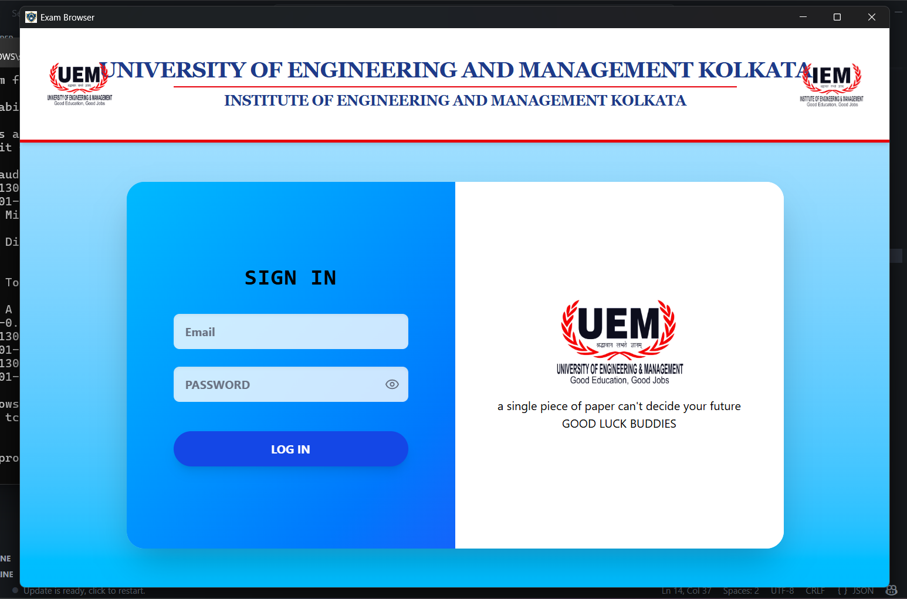
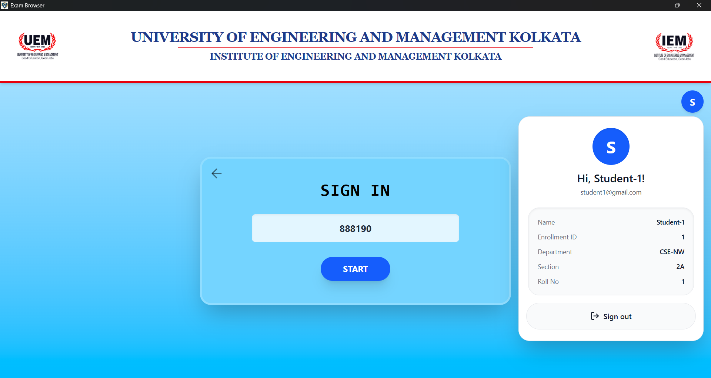
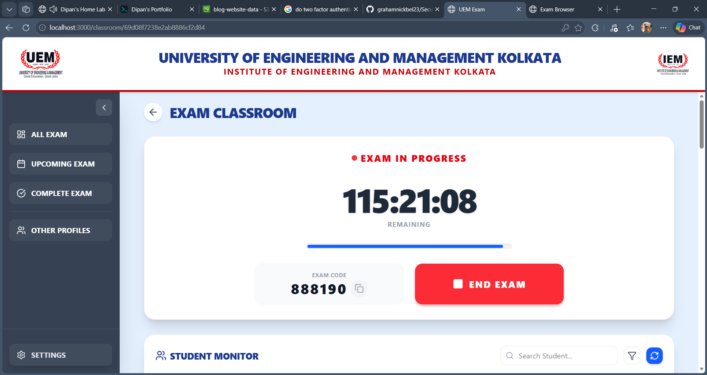
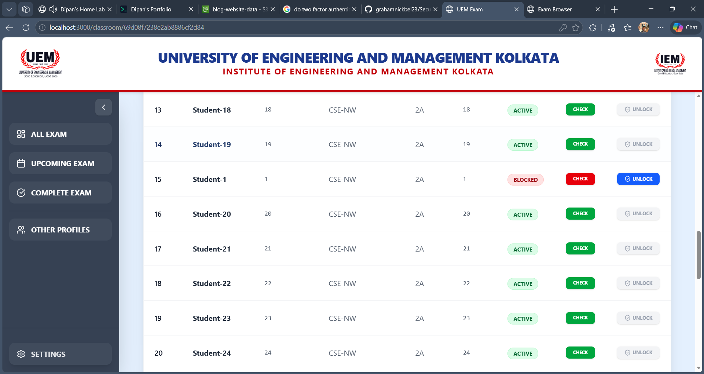
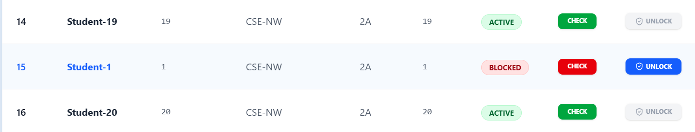
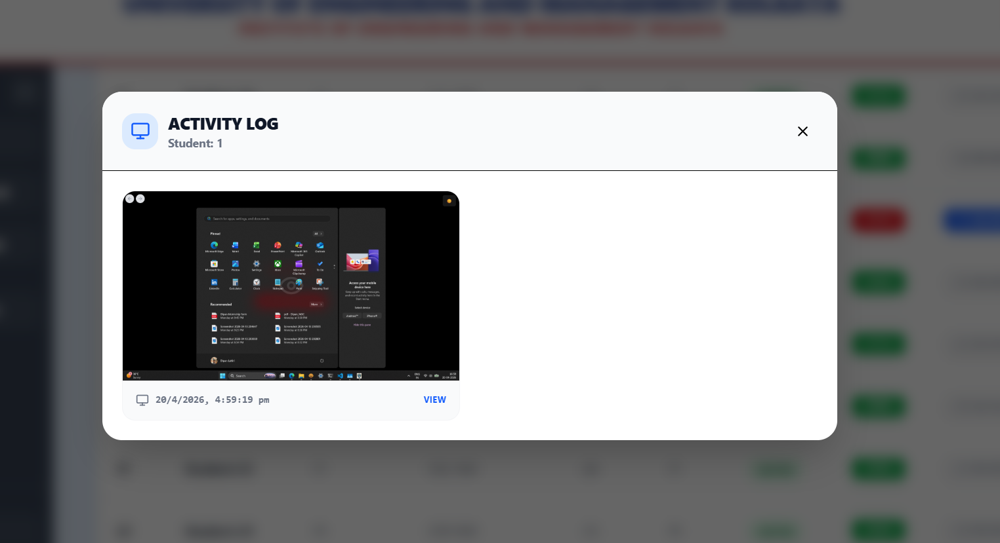

# 🛡️ Secure Exam Browser System

A controlled examination environment that prevents malpractice during online exams by enforcing strict application focus and monitoring student behavior in real time.

---

## 📌 Problem Statement

Online examinations face a critical challenge — ensuring students don't switch tabs or applications, access unauthorized resources, or leave the exam environment mid-session. This system solves that by locking students into a monitored browser where any attempt to leave triggers an automatic screenshot, a security violation report, and forced shutdown of the exam session.

---

## 🖥️ Screenshots

### Student Login


### Student side View


### Teacher side View


### Teacher Portal — Exam Management


### Student Secure Browser (Blocking Active)


### Student Blocking — Screenshot Capture in Action


---

## System Architecture

The system is built around three core components. The **Student Secure Browser** is a custom Electron app that runs in kiosk mode (full-screen, no OS access) and continuously monitors application focus to prevent switching. The **Teacher Portal** provides an interface for registering students, creating exams, and monitoring security violations in real time. The **Backend Server** handles authentication, exam session management, violation reporting, and screenshot storage.

---

## How the System Works

1. Teacher creates an exam and assigns students
2. Student logs into the Secure Browser
3. Browser enters secure kiosk mode — full-screen and locked
4. During the exam, if the student stays focused, normal operation continues. If the student leaves the app, a violation is immediately triggered.

---

## Core Security Mechanism

The browser continuously listens for two window events — `blur` when the application loses focus (student left) and `focus` when it regains focus (student returned). When a blur event fires, a 1.5 second timer starts, a screenshot is captured, a violation report is sent to the server, and the exam session is forcefully shut down.

The 1.5 second delay exists to avoid false positives from accidental clicks, give enough time to capture a screenshot, and ensure the network violation request completes before shutdown.

---

## Screenshot Capture System

Built using native Electron APIs — `desktopCapturer` to capture the current screen and `screen` to retrieve display metadata. The screenshot is captured immediately after a blur event and attached to the violation report sent to the server.

---

## IPC Communication

Electron runs two separate processes. The **Main Process** has system-level access (file system, screen capture, native APIs) while the **Renderer Process** handles UI rendering — what the student sees. IPC (Inter-Process Communication) bridges these two, since the renderer cannot directly access system APIs and the main process acts as a secure intermediary.

---

## Key Components

**`foregroundMonitor.cjs`** detects when a student leaves the exam environment. It listens to `browser-window-blur` and `browser-window-focus` events — starting a shutdown timer on blur and cancelling it on focus.

**`blockApi.cjs`** handles all security violation logic. It captures a screenshot when possible and sends a structured violation event to the backend using a unified function for all violation types:

```js
reportSecurityViolation(type, metadata, screenshotBuffer)
```

---

## Tech Stack

| Layer | Technology |
|---|---|
| Desktop App | Electron |
| Frontend | HTML / CSS / JavaScript |
| Backend | Node.js |
| Screenshot | Electron `desktopCapturer` |
| Communication | IPC (Electron) + REST API |
```
